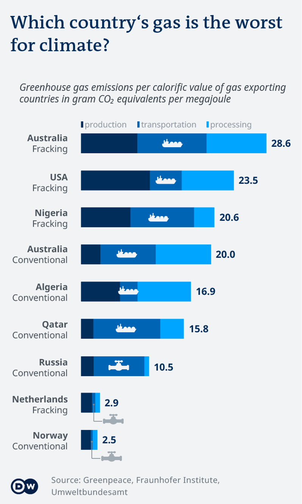

# Europe's LNG investments
_Idea:_  [Michel Penke](https://michelpenke.de/)  

_Research, data analysis and data visualization:_  [Michel Penke](https://michelpenke.de/), Julia Merk

_Writing:_  [Michel Penke](https://michelpenke.de/)

_Editing:_ Henrik Böhme 

**Read the full article on DW.com:**

Since the start of the war in Ukraine in February 2022, Europe is trying to replace Russian gas. Especially Germany, Italy, Netherlands, Slovakia and France are big gas consumers. European countries are now investing billions in LNG infrastructure to replace Russian gas with LNG. However, the EU set itself the goal of being climate neutral by 2050 and that means no LNG. Hydrogen-ready is supposed to be the salvation from this as the LNG infrastructure is meant to be used for hydrogen. However, there are no clear strategies yet and a lot is unclear in regards to the usage of LNG infrastructure for hydrogen. Therefore, these current investments look like an expensive dead end for taxpayers and the climate. This analysis looks at the current investments in LNG infrastructure, the potential of hydrogen and the climate burden. 

In the following, more information on the creation process of the story is shared: Which data sources were used, how the analysis was conducted and how the data was visualized.

# Data

| **Data** | **Source** | **Link** |
| --- | --- | --- |
| Gas consumption in Europe by country| Eurostat| [Data](https://ec.europa.eu/eurostat/statistics-explained/index.php?title=File:Total_imports_and_exports_of_natural_gas,_by_country_of_origin_and_destination,_2020-2021_(terajoules_(Gross_Calorific_Value))_v4.png)  |
| Replacement of pipeline gas | Institut für Seeverkehrswirtschaft und Logistik | [Article](https://www.isl.org/de/news/angriff-russlands-ukraine-stellt-lng-schifffahrt-sehr-grosse-herausforderungen) |
|  | Global Energy Monitor | [Data]() |
| LNG projects in Europe  | Gas Infrastructure Europe | [Data](https://www.gie.eu/transparency/databases/lng-database/) |
| Greenhouse gas emissions for gas of different origins |Greenpeace, Fraunhofer-Gesellschaft, Umweltbundesamt| [Report](https://www.greenpeace.de/publikationen/20220725-greenpeace-report-lng-terminals.pdf), [Report](https://www.isi.fraunhofer.de/content/dam/isi/dokumente/cce/2022/Hintergrundpapier_zu_Gasinfrastrukturen_TransHyDE_final.pdf), [Report](https://www.umweltbundesamt.de/sites/default/files/medien/1410/publikationen/2019-05-15_cc_21-2019_roadmap-gas_lng.pdf), [Report](https://www.umweltbundesamt.de/sites/default/files/medien/1410/publikationen/cc_61-2021_emissionsfaktoren-stromerzeugung.pdf), [Case Study](https://pubs.acs.org/doi/pdf/10.1021/acssuschemeng.1c03307)
| Reports by Think tanks on independency from Russian gas | Agora Energiewende, E3G | [Report](https://static.agora-energiewende.de/fileadmin/Projekte/2021/2021_07_EU_GEXIT/253_Regaining-Europes-Energy-Sovereignty_WEB.pdf), [Report](https://9tj4025ol53byww26jdkao0x-wpengine.netdna-ssl.com/wp-content/uploads/Briefing_EU-can-stop-Russian-gas-imports-by-2025.pdf)
| EU Commission Plan "Fit for 55"| European Council | [Website](https://www.consilium.europa.eu/de/policies/green-deal/fit-for-55-the-eu-plan-for-a-green-transition/)
| IGU World Report 2022| International Gas Union | [Report](https://www.igu.org/resources/world-lng-report-2022/)
| LNG Situation Russia| Several | [Western technology](https://www.upstreamonline.com/lng/russian-government-ignores-plea-to-bankroll-lng-projects/2-1-1283895), [Western partners leaving LNG projects](https://www.highnorthnews.com/en/western-sanctions-delay-opening-arctic-lng-2-project-one-year), [Russias LNG former plans](https://www.reuters.com/business/energy/russias-lng-plans-face-rethink-after-eu-sanctions-equipment-analysts-2022-04-12/), [Older Map of Russian LNG plans](https://www.spglobal.com/commodityinsights/plattscontent/_assets/_images/latest-news/112318-infographic-russia-natgas-lng-large.jpg), Information on the individual LNG projects can easily be found online

# Analysis

### Conventional vs LNG gas production

To show the difference between the conventional gas supply with Russian gas and the supply with LNG gas, an illustration was created based on the explanations of the Greenpeace report. 

### Overview LNG terminals in Europe

For the this graph an area chart with the annual capacity (billion cubic meters) and the year of operation start of existing LNG terminals and one for the incomplete terminals with forecasted year of operation was created. The second graph shows the location of the existing as well as upcoming LNG terminals. The size of the squares is based on the scale of the LNG terminal.

### Hydrogen - the green alternative?

This illustration was created based on the written explanations of the Greenpeace report about the processes of using hydrogen. 

### Which gas is the worst for the climate?
Based on several reports, the CO2-Equivalents were calculated in three categories "Production", "Transport" and "Processing". The CO2-Equivalents were added and therefore allow the comparison of gas from different countries.  

### Overview Russia's LNG terminals
Based on a qualitative research of several sources, the state of different Russian LNG terminals was examined and presented. 

_Caveats: As a lot of the data was difficult to obtain, the result is based on a lot of different data sources and also several expert inverviews._
